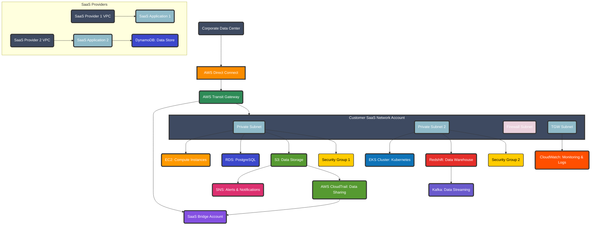

# AWS Architecture Diagram

This diagram represents the AWS infrastructure for Paradigm Shift.

```mermaid

graph TD;
  
  %% Defining the styles to mimic the reference diagram
  classDef ec2 fill:#FF9900,stroke:#333,stroke-width:4px,color:#fff;
  classDef vpc fill:#3E4A61,stroke:#333,stroke-width:4px,color:#fff;
  classDef eks fill:#0E73B8,stroke:#333,stroke-width:4px,color:#fff;
  classDef s3 fill:#569A31,stroke:#333,stroke-width:4px,color:#fff;
  classDef rds fill:#3c48cc,stroke:#333,stroke-width:4px,color:#fff;
  classDef redshift fill:#E52E29,stroke:#333,stroke-width:4px,color:#fff;
  classDef kafka fill:#6A5ACD,stroke:#333,stroke-width:4px,color:#fff;
  classDef api fill:#8450e1,stroke:#333,stroke-width:4px,color:#fff;
  classDef subnet fill:#DAE8FC,stroke:#333,stroke-width:2px,color:#000;
  classDef securitygroup fill:#FFCC00,stroke:#333,stroke-width:2px,color:#000;
  classDef gateway fill:#FBAD00,stroke:#333,stroke-width:4px,color:#fff;
  classDef directconnect fill:#FB8C00,stroke:#333,stroke-width:4px,color:#fff;
  classDef bridge fill:#8450e1,stroke:#333,stroke-width:4px,color:#fff;
  classDef privateSubnet fill:#8FBAC8,stroke:#333,stroke-width:4px,color:#fff;
  classDef publicSubnet fill:#EAD1DC,stroke:#333,stroke-width:4px,color:#fff;
  classDef tgw fill:#2E8B57,stroke:#333,stroke-width:4px,color:#fff;
  classDef cloudwatch fill:#FF4F00,stroke:#333,stroke-width:4px,color:#fff;
  classDef sns fill:#DD3070,stroke:#333,stroke-width:4px,color:#fff;

  %% Defining the flow
  
  %% Customer Network
  A01(Corporate Data Center):::vpc --> A02[AWS Direct Connect]:::directconnect
  A02 --> A03(AWS Transit Gateway):::tgw
  A03 --> B01(Customer VPC):::vpc

  %% Customer VPC layout
  subgraph B01 [Customer SaaS Network Account]
    B02(Private Subnet):::privateSubnet
    B03(Private Subnet 2):::privateSubnet
    B04(Firewall Subnet):::publicSubnet
    B05(TGW Subnet):::privateSubnet
  end
  
  %% Instances and services inside Customer VPC
  B02 --> C01(EC2: Compute Instances):::ec2
  B03 --> C02(EKS Cluster: Kubernetes):::eks
  B02 --> D01(RDS: PostgreSQL):::rds
  B02 --> D02(S3: Data Storage):::s3
  D02 --> D03(SNS: Alerts & Notifications):::sns
  B03 --> E01(Redshift: Data Warehouse):::redshift
  E01 --> F01(Kafka: Data Streaming):::kafka
  
  %% Security Groups inside VPC
  B02 --> G01(Security Group 1):::securitygroup
  B03 --> G02(Security Group 2):::securitygroup
  
  %% SaaS Providers Integration
  A03 --> H01(SaaS Bridge Account):::bridge
  
  subgraph SaaS Providers
    H02(SaaS Provider 1 VPC):::vpc
    H03(SaaS Provider 2 VPC):::vpc
    H02 --> H04(SaaS Application 1):::privateSubnet
    H03 --> H05(SaaS Application 2):::privateSubnet
    H05 --> H06(DynamoDB: Data Store):::rds
  end

  %% CloudWatch for Monitoring
  B05 --> I01(CloudWatch: Monitoring & Logs):::cloudwatch
  
  %% Data sharing and auditing
  D02 --> J01(AWS CloudTrail: Data Sharing):::s3
  J01 --> H01

```
